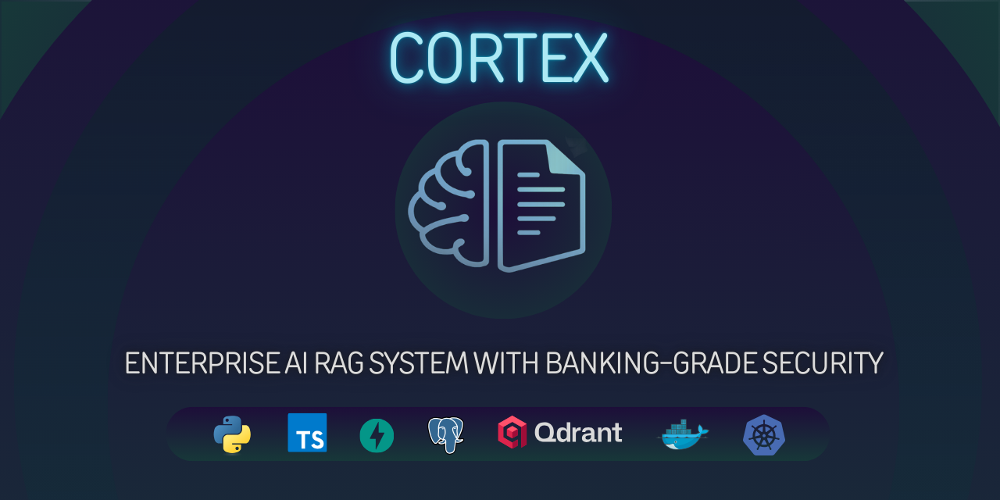
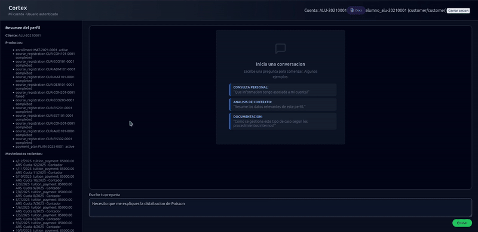

<div align="center">



[](https://github.com/DeepRatAI/cortex-knowledge-assistant/actions/workflows/ci.yml)
[](https://github.com/DeepRatAI/cortex-knowledge-assistant/releases)
[](LICENSE)
[](https://www.python.org/downloads/)
[](docker-compose.yml)
[](https://cortex.deeprat.tech)

**[Live Demo](https://cortex.deeprat.tech)** | **[Documentation](docs/)** | **[Report Bug](https://github.com/DeepRatAI/cortex-knowledge-assistant/issues)** | **[Request Feature](https://github.com/DeepRatAI/cortex-knowledge-assistant/issues)**

---

_Sistema RAG (Retrieval-Augmented Generation) listo para producción que transforma el conocimiento organizacional en un asistente conversacional inteligente. Diseñado para empresas que exigen seguridad, escalabilidad y rendimiento en tiempo real._

</div>

---

## Qué es Cortex

**Cortex** es una plataforma completa de asistente de conocimiento que combina búsqueda vectorial semántica, algoritmos de recuperación híbrida y respuestas LLM en streaming para entregar respuestas precisas y contextuales desde tu corpus documental.

A diferencia de implementaciones RAG básicas, Cortex está diseñado desde cero para **entornos empresariales de producción** con:

- **Arquitectura multi-tenant** con aislamiento de datos por cliente
- **Detección y enmascaramiento de PII** para cumplimiento regulatorio
- **Streaming en tiempo real** via Server-Sent Events
- **Control de acceso basado en roles** con permisos granulares
- **Stack completo de observabilidad** (métricas, logs, trazas)

> **Pruébalo ahora**: Visita la [demo en vivo](https://cortex.deeprat.tech) para ver Cortex en acción con un corpus bancario pre-cargado.

<div align="center">

### Demo en Vivo



_Usuario con rol alumno consultando sobre distribución de Poisson_

</div>

---

## Inicio Rápido

### Requisitos

| Requisito         | Versión | Propósito                                                               |
| ----------------- | ------- | ----------------------------------------------------------------------- |
| Docker            | 20.10+  | Runtime de contenedores                                                 |
| Docker Compose    | 2.0+    | Orquestación multi-contenedor                                           |
| HuggingFace Token | Gratis  | Inferencia LLM ([obtener aquí](https://huggingface.co/settings/tokens)) |

### Setup en 30 Segundos

```bash
# Clone & enter
git clone https://github.com/DeepRatAI/cortex-knowledge-assistant.git
cd cortex-knowledge-assistant

# Configure
cp .env.example .env
echo "HUGGINGFACE_API_TOKEN=your_token_here" >> .env

# Launch
docker compose up -d
```

Abre [http://localhost:3000](http://localhost:3000)

### Comandos CLI

```bash
./start.sh              # Start all services
./stop.sh               # Stop all services
docker compose logs -f  # View logs
docker compose ps       # Check status
```

---

## Características Principales

<table>
<tr>
<td width="50%">

### Motor RAG Inteligente

- **Recuperación Híbrida**: Vectores semánticos + BM25 + scoring por tópico
- **Chunking Inteligente**: Estrategias configurables de overlap y tamaño
- **Re-ranking Cross-Encoder**: Máxima precisión de recuperación
- **Token Streaming**: Generación de respuestas SSE en tiempo real

</td>
<td width="50%">

### Seguridad Enterprise

- **Autenticación JWT**: Auth stateless y escalable
- **RBAC**: Definiciones de roles Admin, User y personalizados
- **Detección PII**: DNI, tarjetas de crédito, emails, teléfonos
- **Auto-Masking**: Sanitización configurable de respuestas

</td>
</tr>
<tr>
<td width="50%">

### Multi-Tenancy

- **Aislamiento de Clientes**: Segregación completa de datos
- **Filtrado por Materia**: Control de acceso basado en tópicos
- **Audit Trail**: Logging completo de consultas/respuestas
- **Gestión de API Keys**: Credenciales por tenant

</td>
<td width="50%">

### Observabilidad de Producción

- **Métricas Prometheus**: Endpoint `/metrics`
- **Health Checks**: Probes `/health` y `/ready`
- **Logging Estructurado**: JSON con correlation IDs
- **Trazabilidad**: Tracking end-to-end de requests

</td>
</tr>
</table>

---

## Arquitectura

```
┌─────────────────────────────────────────────────────────────────────────────┐
│                           CORTEX ARCHITECTURE                                │
├─────────────────────────────────────────────────────────────────────────────┤
│                                                                              │
│    ┌─────────────┐      ┌──────────────────┐      ┌─────────────────────┐  │
│    │   React UI  │─────▶│   FastAPI Core   │─────▶│   Qdrant Vector DB  │  │
│    │  (Vite/TS)  │      │   (Python 3.12)  │      │   (12,000+ docs)    │  │
│    └─────────────┘      └────────┬─────────┘      └─────────────────────┘  │
│          │                       │                                          │
│          │              ┌────────┴────────┐                                 │
│          │              │                 │                                 │
│          │         ┌────▼────┐      ┌─────▼────┐      ┌─────────────────┐  │
│          │         │  Redis  │      │   LLM    │      │   PostgreSQL    │  │
│          │         │  Cache  │      │(Llama 3) │      │  (Users/Auth)   │  │
│          │         └─────────┘      └──────────┘      └─────────────────┘  │
│          │                                                                  │
│    ┌─────▼─────────────────────────────────────────────────────────────┐   │
│    │                     Cloudflare Tunnel (HTTPS)                      │   │
│    │            cortex.deeprat.tech  ←→  api.cortex.deeprat.tech        │   │
│    └────────────────────────────────────────────────────────────────────┘   │
│                                                                              │
└─────────────────────────────────────────────────────────────────────────────┘
```

### Stack Tecnológico

| Capa                | Tecnologías                             | Por Qué Esta Elección                       |
| ------------------- | --------------------------------------- | ------------------------------------------- |
| **Frontend**        | React 18, TypeScript, Vite, TailwindCSS | Type-safe, builds rápidos, DX moderno       |
| **Backend**         | FastAPI, Python 3.12, Pydantic v2       | Async-nativo, auto OpenAPI docs, validación |
| **Vector DB**       | Qdrant                                  | Alto rendimiento, filtrado, snapshots       |
| **Cache**           | Redis                                   | Gestión de sesiones, rate limiting          |
| **Database**        | PostgreSQL                              | Usuarios, roles, audit logs                 |
| **LLM**             | HuggingFace Inference (Llama 3.1 8B)    | Tier gratuito, sin GPU requerida            |
| **Embeddings**      | sentence-transformers (multilingüe)     | Soporte Español/Inglés                      |
| **Infraestructura** | Docker Compose, Cloudflare Tunnel       | HTTPS zero-config, edge caching             |

---

## Estructura del Proyecto

```
cortex-knowledge-assistant/
├── src/cortex_ka/           # Core Python package
│   ├── api/                 # FastAPI routes & middleware
│   ├── application/         # RAG service, DLP, chunking, prompts
│   ├── auth/                # JWT, RBAC, session management
│   ├── domain/              # Models, ports (hexagonal architecture)
│   ├── infrastructure/      # Adapters: Qdrant, HuggingFace, Redis
│   ├── transactions/        # Service instances, audit logging
│   ├── system/              # Setup, status, admin operations
│   ├── scripts/             # Ingestion, evaluation, maintenance
│   └── demos/               # Demo mode functionality
├── ui/                      # React 18 + TypeScript + Vite frontend
├── tests/                   # Pytest suite (35+ test files)
├── docker/                  # Dockerfile variants & compose files
├── docs/                    # Complete documentation suite
├── scripts/                 # Utility scripts & demos
└── k8s/                     # Kubernetes manifests (production-ready)
```

---

## Opciones de Despliegue

### Desarrollo (Docker Compose)

```bash
docker compose up -d
```

| Servicio          | Puerto | Propósito               |
| ----------------- | ------ | ----------------------- |
| `cortex_api`      | 8088   | Backend FastAPI         |
| `cortex_ui`       | 3000   | Frontend React          |
| `cortex_qdrant`   | 6333   | Base de datos vectorial |
| `cortex_redis`    | 6379   | Capa de cache           |
| `cortex_postgres` | 5432   | Datos relacionales      |

### Producción (con Cloudflare Tunnel)

```bash
# Ya configurado para este proyecto
docker run -d --name cloudflared-cortex \
  --network host \
  --restart unless-stopped \
  cloudflare/cloudflared:latest \
  tunnel run --token YOUR_TUNNEL_TOKEN
```

### Configuración de Entorno

```env
# .env (required)
HUGGINGFACE_API_TOKEN=hf_xxxxxxxxxxxxx

# .env (optional)
CKA_JWT_SECRET=your-secret-key-change-in-production
CKA_LOG_LEVEL=INFO
CKA_PII_MASK_ENABLED=true
CKA_QDRANT_HOST=cortex_qdrant
CKA_REDIS_HOST=cortex_redis
CKA_POSTGRES_HOST=cortex_postgres
```

---

## Desarrollo

### Setup Local

```bash
# Crear entorno
python -m venv .venv
source .venv/bin/activate

# Instalar dependencias
pip install -r requirements.txt -r requirements-dev.txt

# Ejecutar tests
make test        # Todos los tests
make test-fast   # Saltar slow/e2e
make coverage    # Con reporte de coverage

# Calidad de código
make lint        # Ruff + mypy
make format      # Black + isort
```

### Documentación API

Docs interactivos disponibles en runtime:

- **Swagger UI**: http://localhost:8088/docs
- **ReDoc**: http://localhost:8088/redoc
- **OpenAPI JSON**: http://localhost:8088/openapi.json

---

## Roadmap

| Versión    | Estado  | Enfoque                                                                   |
| ---------- | ------- | ------------------------------------------------------------------------- |
| **Beta**   | Actual  | Core RAG, multi-tenancy, PII detection, streaming, RBAC, Kubernetes ready |
| **v1.0.0** | Próximo | Customer Experience, Employee Productivity, Admin Operations, UX Polish   |

La v1.0.0 prioriza **estabilidad operativa y experiencia de usuario** sobre expansión funcional. Cada dominio (Customer, Employee, Admin) tendrá su superficie funcional completa.

> Ver [ROADMAP.md](docs/ROADMAP.md) para el detalle completo incluyendo Design Intent, Status por feature y criterios de priorización.

---

## Contribuir

Las contribuciones son bienvenidas. Ver [CONTRIBUTING.md](CONTRIBUTING.md) para las guías.

```bash
# Fork → Clone → Branch → Commit → Push → PR
git checkout -b feature/your-amazing-feature
git commit -m "feat: add amazing feature"
git push origin feature/your-amazing-feature
```

---

## Licencia

Este proyecto tiene licencia dual:

| Caso de Uso     | Licencia                                    | Detalles                          |
| --------------- | ------------------------------------------- | --------------------------------- |
| **Open Source** | [AGPL-3.0](LICENSE-AGPL)                    | Gratis para proyectos open source |
| **Comercial**   | [Licencia Comercial](LICENSE-COMMERCIAL.md) | Contactar para uso propietario    |

Ver [LICENSE](LICENSE) para detalles completos.

---

## Documentación

Documentación completa disponible en [`docs/`](docs/index.md):

| Documento                                | Descripción                                   |
| ---------------------------------------- | --------------------------------------------- |
| [Índice](docs/index.md)                  | Punto de entrada y navegación                 |
| [Inicio Rápido](docs/getting-started.md) | Instalación y primera consulta                |
| [Arquitectura](docs/architecture.md)     | Diseño hexagonal, componentes, flujo de datos |
| [API Reference](docs/api-reference.md)   | 50+ endpoints documentados con ejemplos       |
| [Configuración](docs/configuration.md)   | 40+ variables de entorno                      |
| [Seguridad](docs/security.md)            | JWT, RBAC, multi-tenancy, DLP, PII            |
| [Despliegue](docs/deployment.md)         | Docker Compose, producción, Kubernetes        |
| [Desarrollo](docs/development.md)        | Testing, contribución, arquitectura interna   |
| [Roadmap](docs/ROADMAP.md)               | Features planificadas para v1.0.0             |
| [ADRs](docs/adr/)                        | Architecture Decision Records                 |

---

## Agradecimientos

Construido con estos excelentes proyectos open source:

- **[FastAPI](https://fastapi.tiangolo.com/)** – High-performance async web framework
- **[Qdrant](https://qdrant.tech/)** – Vector similarity search engine
- **[HuggingFace](https://huggingface.co/)** – LLM inference infrastructure
- **[sentence-transformers](https://www.sbert.net/)** – State-of-the-art embeddings
- **[React](https://react.dev/)** – UI component library

---

<div align="center">

### Built by [DeepRatAI](https://github.com/DeepRatAI)

[](https://github.com/DeepRatAI)
[](mailto:deeprat.tec@gmail.com)

_Si encuentras útil este proyecto, considera darle una ⭐_

</div>
